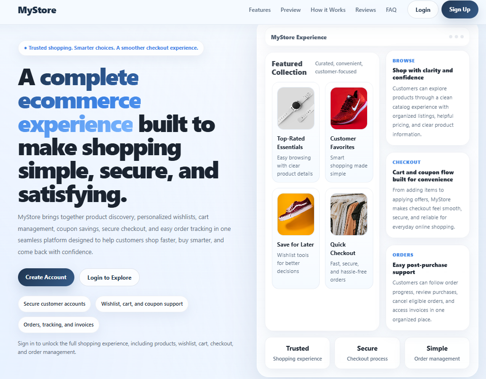
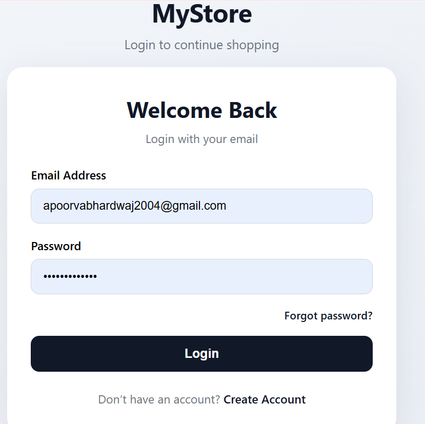
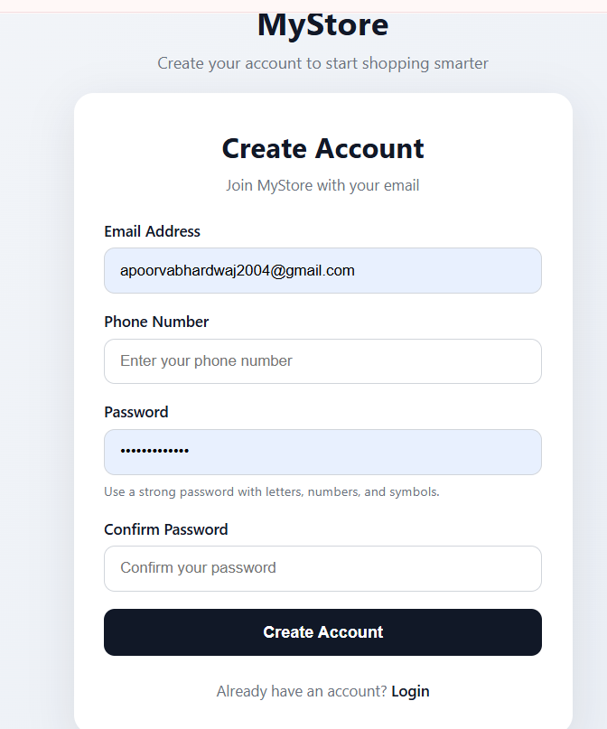
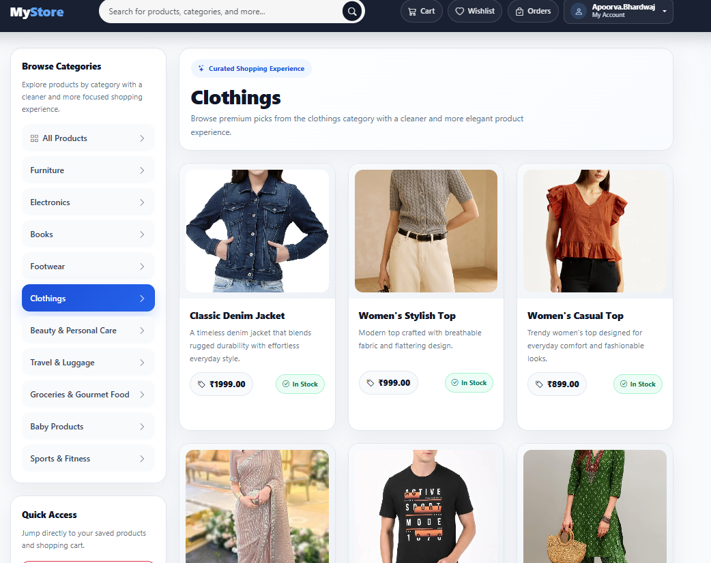
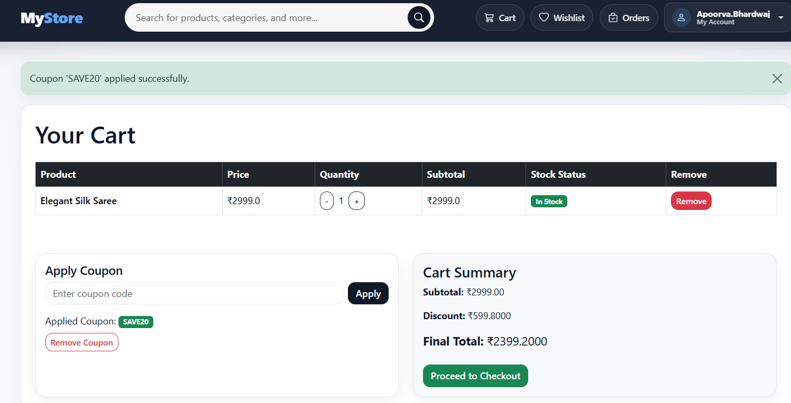
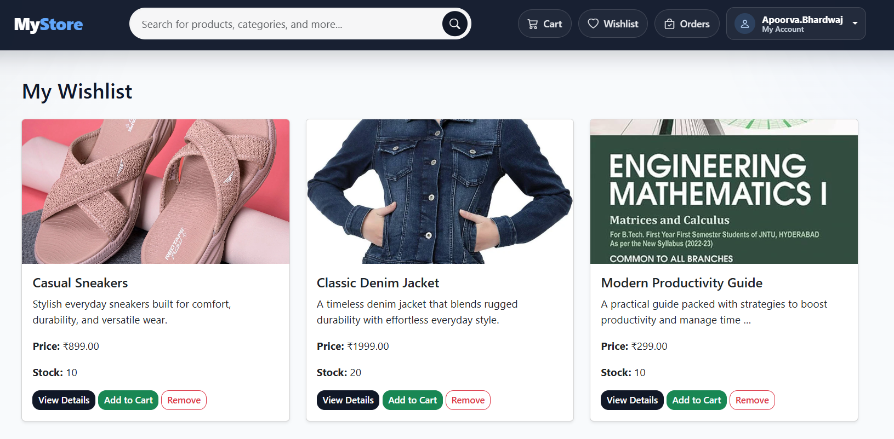
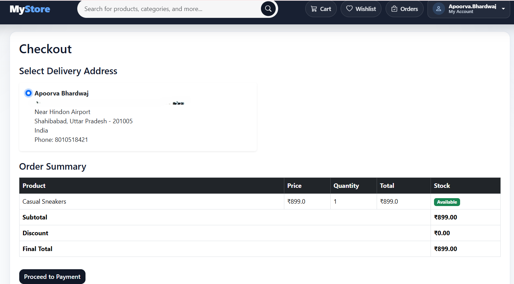
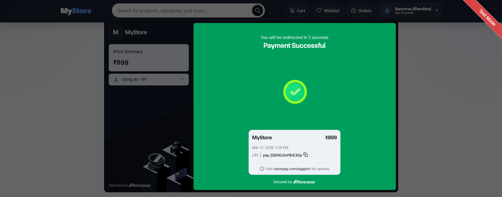
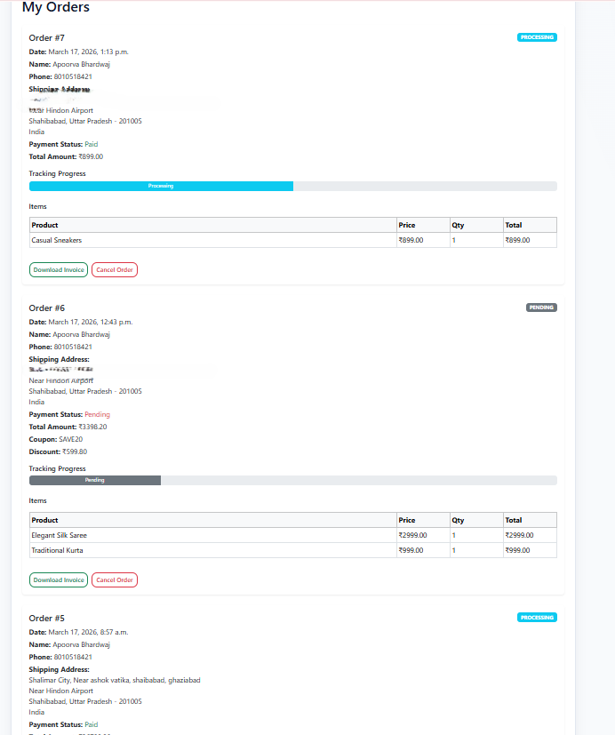
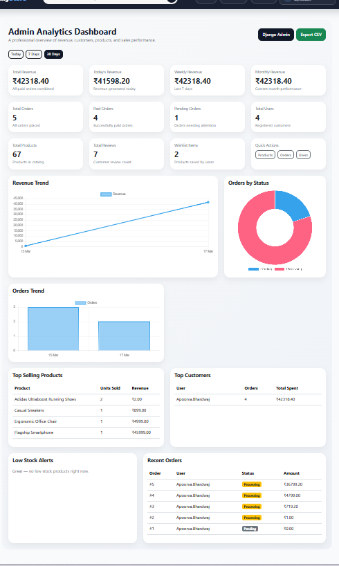

# 🛒 Django Full Stack E-Commerce Web Application


A full-stack e-commerce web application built using **Django**, featuring authentication, product browsing, cart management, wishlist support, order handling, password reset, and **Razorpay payment integration**. The project is deployed on **Render** with **PostgreSQL** as the production database.

---

## 🔗 Live Demo

**Live Website:**  
[https://django-full-stack-ecommerce-project.onrender.com](https://django-full-stack-ecommerce-project.onrender.com)

**GitHub Repository:**  
[https://github.com/apoorvabhardwaj28/Django-Full-Stack-Ecommerce-Project](https://github.com/apoorvabhardwaj28/Django-Full-Stack-Ecommerce-Project)

---

## ✨ Features

- User authentication: Signup, Login, Logout
- Email-based login system
- Google OAuth login with Django Allauth
- Password reset via email
- Product listing and product detail pages
- Category-wise product browsing
- Wishlist functionality
- Add to cart / remove from cart
- Stock deduction and out-of-stock handling
- Order placement and order history
- Order cancellation feature
- Razorpay payment gateway integration
- Responsive and clean user interface
- PostgreSQL database integration
- Deployed on Render

---

## 🛠️ Tech Stack

### Backend
- Django
- Python

### Frontend
- HTML
- CSS
- JavaScript
- Bootstrap

### Database
- PostgreSQL

### Authentication
- Django Authentication
- Django Allauth
- Google OAuth

### Payments
- Razorpay

### Deployment
- Render
- WhiteNoise for static files

---

## 📸 Screenshots

### Landing Page


### Login Page


### Signup Page


### Product Listing Page


### Cart Page


### Wishlist Page


### Checkout Page


### Payment Completed Page


### Order History Page


### Admin Dashboard

---

## ⚙️ Installation Guide

### 1. Clone the repository

```bash
git clone https://github.com/apoorvabhardwaj28/Django-Full-Stack-Ecommerce-Project.git
cd Django-Full-Stack-Ecommerce-Project
```

### 2. Create and activate a virtual environment

#### Windows
```bash
python -m venv venv
venv\Scripts\activate
```

### 3. Install dependencies

```bash
pip install -r requirements.txt
```

### 4. Create a `.env` file

Create a `.env` file in the project root and add the following:

```env
SECRET_KEY=your_secret_key
DEBUG=True

DB_NAME=your_database_name
DB_USER=your_database_user
DB_PASSWORD=your_database_password
DB_HOST=localhost
DB_PORT=5432

EMAIL_HOST_USER=your_email
EMAIL_HOST_PASSWORD=your_email_app_password

RAZORPAY_KEY_ID=your_razorpay_key
RAZORPAY_KEY_SECRET=your_razorpay_secret

DOMAIN=127.0.0.1:8000
```

### 5. Apply migrations

```bash
python manage.py migrate
```

### 6. Create superuser

```bash
python manage.py createsuperuser
```

### 7. Run the development server

```bash
python manage.py runserver
```

Now open:  
[http://127.0.0.1:8000](http://127.0.0.1:8000)

---

## 🚀 Deployment

This project is deployed on **Render**.

### Production Setup Includes
- PostgreSQL database on Render
- Environment variables configured securely
- WhiteNoise used for static file handling
- Gunicorn used as WSGI server

---

## 📂 Project Structure

```bash
Django-Full-Stack-Ecommerce-Project/
│
├── accounts/            # User authentication and profile management
├── cart/                # Cart functionality
├── config/              # Project settings and main URLs
├── order/               # Orders, checkout, payments
├── products/            # Product models, views, wishlist, reviews
├── static/              # Static assets
├── templates/           # HTML templates
├── manage.py
├── requirements.txt
└── README.md
```

---

## ✅ Implemented Enhancements

- Wishlist feature
- Password reset functionality
- Stock deduction and stock checks
- Out-of-stock handling
- Order cancellation
- Responsive UI improvements
- PostgreSQL production integration
- Render deployment

---

## 📌 Notes

- The project uses **PostgreSQL** in production.
- Payment functionality is integrated using **Razorpay**.
- Google login is handled with **Django Allauth**.
- Static files are managed using **WhiteNoise** for deployment.

---

## 👨‍💻 Author

**Apoorva Bhardwaj**

- GitHub: [apoorvabhardwaj28](https://github.com/apoorvabhardwaj28)
- LinkedIn: [apoorva-bhardwajj](https://linkedin.com/in/apoorva-bhardwajj)

---

## ⭐ If you like this project

Give it a star on GitHub.
